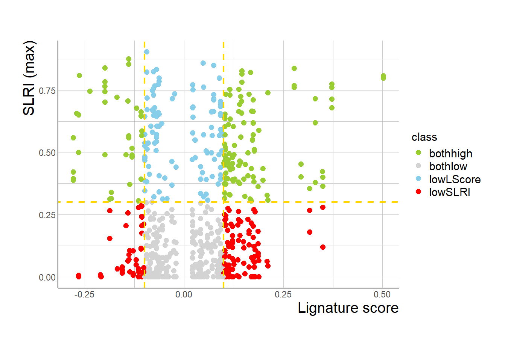
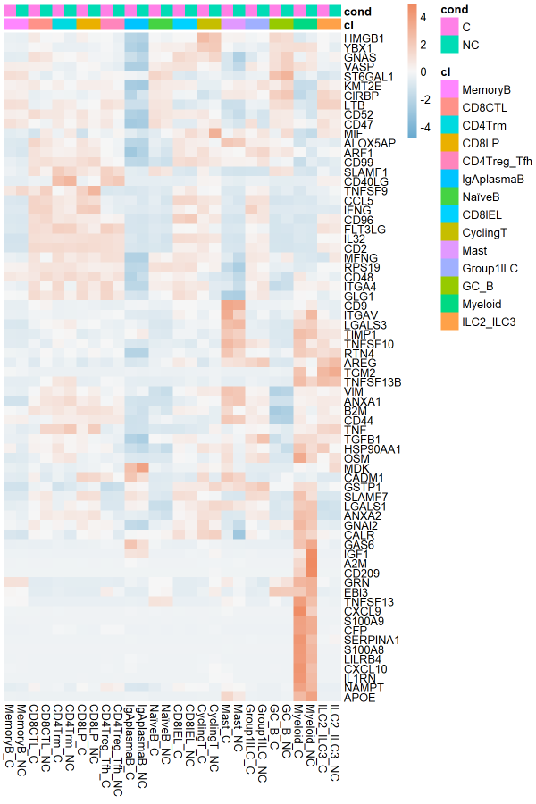
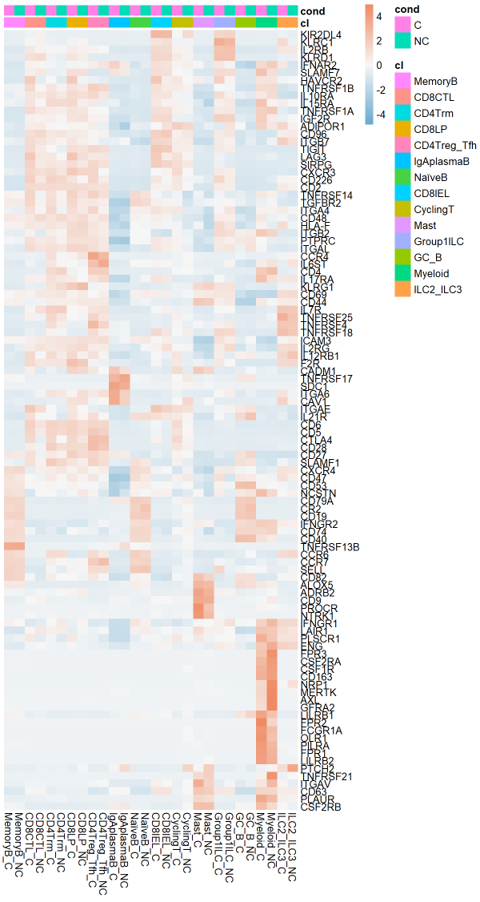
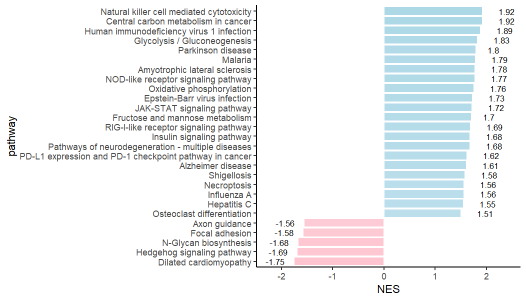
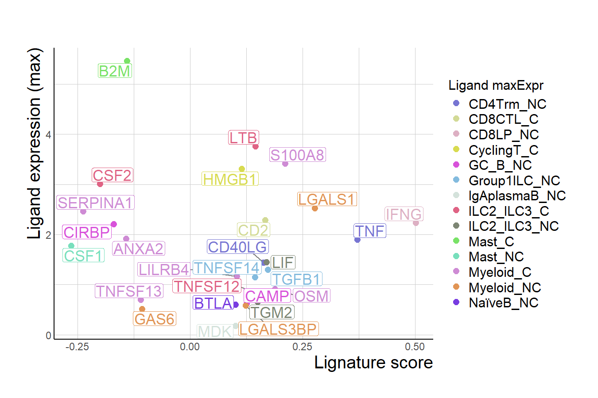
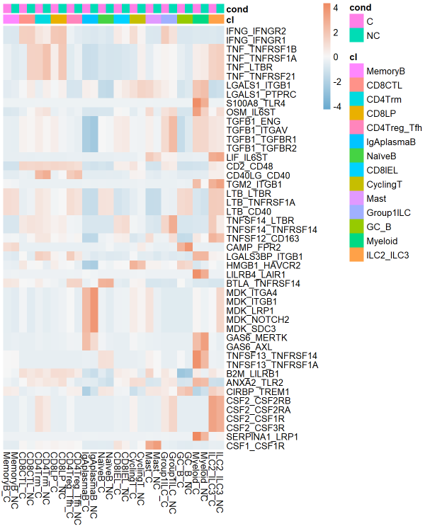
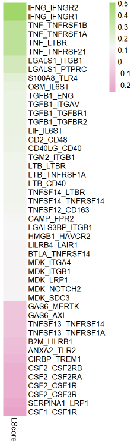
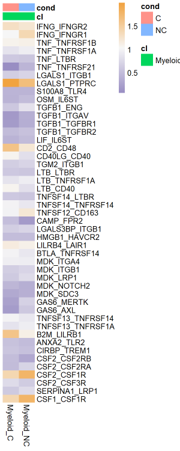
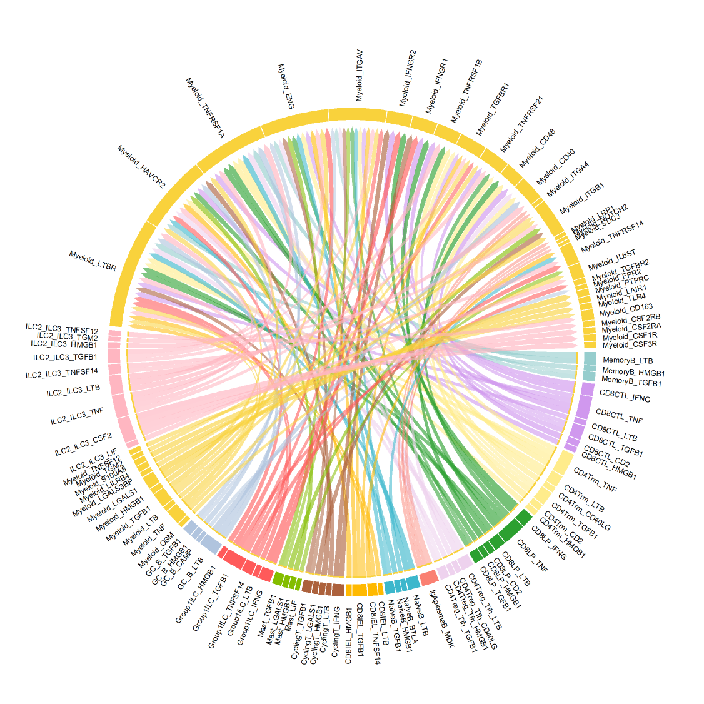

### Load packages

``` r
    library(Seurat)
    library(RColorBrewer)
    library(pheatmap)
    library(fgsea)
    library(graphite)
    library(lsa)
    library(devtools)
    library(data.table)
    library(geneconverter) 
    library(circlize)
    library(tidyverse)
    library(randomcoloR)
    library(hrbrthemes)
    library(ggrepel)
    library(Lignature)
    `%!in%` <- Negate(`%in%`)
    `%notin%` <- Negate(`%in%`)
```

### Load Lignature data

Lignature data can be downloaded at
[LignatureData](https://github.com/yingxinac/LignatureData/)

``` r
    load("siglist.RData")
    load("sigmeta.RData")
    load("lr_network_hg.RData")
    # Remark:
    # lr_network is a data.frame, each row represents a LR-interaction pair with the first four columns named "L", "Lgene", "R", and "Rgene", 
    # representing ligand name (match the ligand names in Lignature), ligand gene symbol(s), receptor name, and receptor gene symbol(s); 
    # For a ligand or receptor with sub-units, say unitA and unitB, the gene symbols should be connected by "_" in the L/Rgene column as "unitAgene_unitBgene".
    # One can filter lr_network, for example: lr_network = lr_network[lr_network$database != "NATMI",,drop=F]
    lr_network = unique(as.matrix(lr_network)[,c("L", "Lgene", "R", "Rgene")])
    load("mykegg_10500.RData")
    # Remark: 
    # mykegg is a list of gene-nodes in KEGG pathways.
    # One can update the list as well as the Lignature signatures (this might need a while):
    # mykegg = getPathNodes(numnode_min = 10, numnode_max = 500)
    # siglist = updatePathSigs(siglist = siglist, keggnodes = mykegg, progress_interval = 10)
```

### Group signatures by treatment ligands

``` r
    siggroupsoutput = groupSigs(siglist = siglist, sigmeta = sigmeta)
    sigLs = siggroupsoutput$sigLs
    siggroups = siggroupsoutput$siggroups
```

### Load input data

``` r
    load("seuratobj.RData")
    # Remark:
    # The input Seurat object should be LogNormalized.
    # Sample-conditions and cell-types/clusters should be stored in the columns "cond" and "cl" of the meta.data.
    # > head(seuratobj@meta.data)
    #                            orig.ident nCount_RNA nFeature_RNA log10GenesPerUMI percent.mt  mitoRatio  sample cond      cl     clcond
    # C1_CD45_AAACCTGAGCGATCCC-1    C1_CD45       3830         1303        0.8693195   5.796345 0.05796345 C1_CD45    C MemoryB MemoryB(C)
    # C1_CD45_AAACCTGAGTAAGTAC-1    C1_CD45       5413         1903        0.8783965   3.103639 0.03103639 C1_CD45    C  CD8CTL  CD8CTL(C)
    # C1_CD45_AAACCTGCAAGCGCTC-1    C1_CD45       3697         1367        0.8788960   3.786854 0.03786854 C1_CD45    C  CD4Trm  CD4Trm(C)
    # C1_CD45_AAACCTGCAGTGACAG-1    C1_CD45       1322          857        0.9396871   3.025719 0.03025719 C1_CD45    C  CD4Trm  CD4Trm(C)
    # C1_CD45_AAACCTGCATGTCGAT-1    C1_CD45       3421         1387        0.8890607   3.741596 0.03741596 C1_CD45    C  CD4Trm  CD4Trm(C)
    # C1_CD45_AAACCTGGTCTAGTGT-1    C1_CD45       4665         1836        0.8896170   3.751340 0.03751340 C1_CD45    C   CD8LP   CD8LP(C)
    # > table(seuratobj@meta.data$cond)
    #     C    NC 
    # 19619 16975 
    # > table(seuratobj@meta.data$cl)
    # CD4Treg_Tfh      CD4Trm      CD8CTL      CD8IEL       CD8LP    CyclingT        GC_B   Group1ILC  IgAplasmaB   ILC2_ILC3        Mast     MemoryB     Myeloid      NaïveB 
    #        3037        6191        3337        1799        2834        1148         126         302       11890         191         944        2212        1257        1326 
```

### Get gene average expression, detection rate, and differential expression info

``` r
    conds = c("C", "NC") 
    condpairs = matrix(c("C", "NC"), ncol = 2)
    colnames(condpairs) = c("cond1", "cond2") 
    # Remark:
    # condpairs is a matrix with two columns "cond1" and "cond2", nrow(condpairs) >= 1, 
    # each row is ordered representing a comparison between two sample-conditions cond1 vs cond2 in differential expression analysis.
    allcls = unique(seuratobj@meta.data$cl)
    exprinfo = getExprInfo(seuratobj = seuratobj, cls = allcls, conds = conds, condpairs = condpairs) 
```

### Get signatures of input data

``` r
    mysiglist = getMySigs(DElist = exprinfo$DElist, cls = allcls, condpairs = condpairs, keggnodes = mykegg,
                          pctcut = 0.1, belowpctcut = "lowpct.remove")
    # Remark: in this example, genes with detection rate below 0.1 are removed from the signature, as specified by pctcut = 0.1 and belowpctcut = "lowpct.remove".
```

### Get expression-based LR-interaction scores and score-specificities

``` r
    LRIscorelist = getLRIScore(lr_network = lr_network, exprinfo = exprinfo, LRI.method = "scsigr")
    # LRI.method: "cpdb", "natmi", or "scsigr".
```

### Get ligand-scores for specified receiver cells and sample-condition pair

**(e.g. “Myeloid” cells, “C\_vs\_NC”)**

``` r
    cl_to = "Myeloid"
    condpair = "C_vs_NC"
    sigscorelist = getSigScore(siglist = siglist, testsig = mysiglist[[cl_to]][[condpair]], whichsig = "lfc", 
                               method = "cor.pearson", nump = 1000, corpby.permu = FALSE)
    Lscoredf = getLScore(siggroups = siggroups, lr_network = lr_network, sigscorelist = sigscorelist, pvalcut = 0.1)
    # Remark:
    # pvalcut -- only signatures with score-pvalues below this cutoff are used for scoring the ligands in Lignature.
    # In the matrices of the output list, the first five columns represent ligand-scores calculated by the mean, median, max, min, and maximum absolute values of the signature-scores corresponding to each ligand,
    # "sign-maxabs" provides the sign of the signature-score with the maximum absolute values, "pos_maxabs" and "neg_maxabs" provide the signature-scores with the highest absolute values among
    # signatures with positive or negative socres corresponding to each signature, and the columns "sig_***" specify the signautre-ids corresponding to the ligand-scores.
```

### Organize LR info

``` r
    LRinfolist = getLRinfosummary(exprinfo = exprinfo, LRIscorelist = LRIscorelist, Lscoredf = Lscoredf, lr_network = lr_network, 
                                  cl_to = cl_to, condpair = condpair)
    # Remark: in the matrics of the output lis, "condmax" in the column names represents maximum values across conditions.
 ```
    
**Get scatter plot of specified ligand scores and LR-interactoin scores (maximum from all sender cells) for LR pairs with these scores available**

``` r
    getScatterLRpairs(LRinfolist = LRinfolist, cls_from = allcls, cl_to = cl_to, Lscore.by = "Lscore_signed_maxabs", SLRI.by = "SLRI_condmax",
                  point.size = 3, Lscore.cut = 0.1, SLRI.cut = 0.3)
    # Remark: Lscore.by specifies which ligand score to plot, can be any of "Lscore_mean", "Lscore_median", "Lscore_max", "Lscore_min", "Lscore_max_abs", and "Lscore_signed_maxabs".
    # Similarly, SLRI.by specifies which LR-interaction score to plot.
```



### Filter the LR-interactions

``` r
    cut.by = c("Lscore_max_abs", "SLRI_condmax", "SLRIspec_condmax", "Lpct_condmax", "Rpct_condmax")
    cut.bounds = list(c(0.1, Inf), c(0.3, Inf), c(0.75, Inf), c(0.25,Inf), c(0.25, Inf)) 
    names(cut.bounds) = cut.by
    # Remark: for each entry x in cut.by with a pair of ordered cut.bounds c(lower.bound, upper.bound): 
    # when lower.bound <= upper.bound, we require x >= lower.bound and x <= upper.bound;
    # when lower.bound > upper.bound, we require x >= lower.bound or x <= upper.bound.
    # Make sure that length(cut.by) == length(cut.bounds)
    LRinfo_fil = filterLRinfo(LRinfolist = LRinfolist, cut.bounds = cut.bounds)
```

### Create tables and plots

**Write tables in .csv files**

``` r
    mydir = "outputtables/" # specify the output directory
    writeLRtable(tablelist = LRinfo_fil$LRinfolist_fil, mydir = mydir)
```

**Plot expression of differentially expressed ligand- and receptor-genes
in each cell-type/cluster, each condition, in heatmap**

``` r
    whichLs = "in.Lignature.only" # "in.lrnetwork" or "in.Lignature.only"
    col = rev(colorRampPalette(brewer.pal(3, "RdBu"))(1000))
    plotDELRheatmap(exprinfo = exprinfo, siggroups = siggroups, lr_network = lr_network, LorR = "L",
                    whichLs = whichLs, cls = allcls, condpair = condpair, pct.cut = 0.25, padj.cut = 0.01, lfc.cut = 0.2, col = col)
    plotDELRheatmap(exprinfo = exprinfo, siggroups = siggroups, lr_network = lr_network, LorR = "R",
                    whichLs = whichLs, cls = allcls, condpair = condpair, pct.cut = 0.25, padj.cut = 0.01, lfc.cut = 0.2, col = col)
```



**Pathway NES barplot**

``` r
    getKEGGNESbarplot(mysig = mysiglist[[cl_to]][[condpair]], padj.cut = 0.1)
```



**For ligands in identified LR interactions, create scatterplot of specified ligand scores and the maximum avgexpr levels acorss all sender cells and conditions**

``` r
    getScatter(LRinfolist = LRinfolist, LRs = LRinfo_fil$lrs_fil_union, cls_from = allcls, cl_to = cl_to, condpair = condpair, 
           Lscore.by = "Lscore_signed_maxabs", point.size = 3)
    # Remark: Lscore.by can be any of "Lscore_mean", "Lscore_median", "Lscore_max", "Lscore_min", "Lscore_max_abs", and "Lscore_signed_maxabs".
```



**For identified LR-interactions, plot the average expression of the
ligands in sender cells in each condition, average expression of the
receptors in specified receiver cells in each condition, and the
corresponding ligand scores**

``` r
    col = rev(colorRampPalette(brewer.pal(3, "RdBu"))(1000))
    plotLRs(LRinfolist = LRinfolist, LRs = LRinfo_fil$lrs_fil_union, cls_from = allcls, cl_to = cl_to, condpair = condpair, plotwhich = "Lavgexpr",
            Lscore.by = "Lscore_signed_maxabs", order.by = "Lscore_signed_maxabs", order.decreasing = T, 
            col = col, scale = "row", show_rownames = T)

    col = rev(colorRampPalette(brewer.pal(3, "PuOr"))(1000))
    plotLRs(LRinfolist = LRinfolist, LRs = LRinfo_fil$lrs_fil_union, cls_from = allcls, cl_to = cl_to, condpair = condpair, plotwhich = "Ravgexpr",
            Lscore.by = "Lscore_signed_maxabs", order.by = "Lscore_signed_maxabs", order.decreasing = T, 
            col = col, scale = "none", show_rownames = T)

    col = colorRampPalette(brewer.pal(3, "PiYG"))(1000)
    plotLRs(LRinfolist = LRinfolist, LRs = LRinfo_fil$lrs_fil_union, cls_from = allcls, cl_to = cl_to, condpair = condpair, plotwhich = "LScore",
            Lscore.by = "Lscore_signed_maxabs", order.by = "Lscore_signed_maxabs", order.decreasing = T, 
            col = col, scale = "none", show_rownames = T)
```



**circos plot**

``` r
    # One can easily apply different filtering criteria for each plot, for example:
    cut.by = c("Lscore_max", "SLRI_condmax", "SLRIspec_condmax", "Lpct_condmax", "Rpct_condmax")
    cut.bounds = list(c(0.1, Inf), c(0.3, Inf), c(0.9, Inf), c(0.25,Inf), c(0.25, Inf)) 
    names(cut.bounds) = cut.by
    LRinfo_fil2 = filterLRinfo(LRinfolist = LRinfolist, cut.bounds = cut.bounds)
    # Specify colors and plot:
    mycols = c("paleturquoise3", "#D098EE", "lightgoldenrod1","#2CA030","thistle2","salmon","#3CB7CC","#FFB900","#AC613C","#84BD00","#FF5A5A","lightsteelblue","#F9D23C","lightpink")
    getCircosPlot(plotLRinfolist = LRinfo_fil2$LRinfolist_fil, plotcond = "condmax", cls_from = allcls, cl_to = cl_to, mycols = mycols, 
                  width_same_ligand_cluster = 0.2, width_different_ligand_cluster = 0.5, width_same_receptor_cluster = 0.2, width_different_receptor_cluster = 0.5, width_ligand_receptor = 1,
                  cplotthresh = 0.1, cex = 1, transupperbase = 1.5, transidx = 0.5)
```


